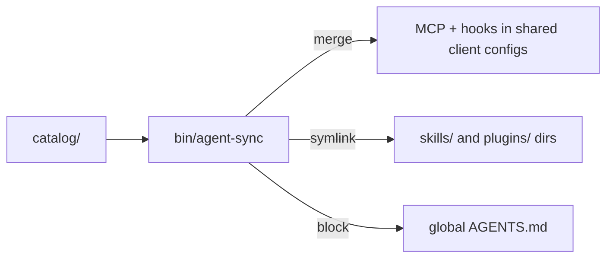

# Agent configs: MCP servers, skills, plugins, hooks & instructions

[](https://github.com/msetsma/.dotfiles-agents/blob/main/LICENSE) [](https://github.com/msetsma/.dotfiles-agents/commits/main)

A catalog-driven config for coding agents. MCP servers (custom and third-party),
skills, plugins, hooks, and per-tool instructions are declared once in
[`catalog/`](catalog/) and synced into each agent by one command.

---

## Layout

```
.dotfiles-agents/
├── catalog/                # single source of truth — one file per resource
│   ├── mcp/*.toml          # MCP servers (custom + third-party)
│   ├── skills/<name>.toml  # skills (content in <name>/SKILL.md)
│   ├── plugins/<name>.toml # opencode plugins (content in <name>.ts)
│   ├── hooks/<name>.toml   # Claude Code / Codex event hooks
│   ├── instructions/*.toml # per-tool prompts (content in <name>.md)
│   ├── clients.toml        # where each agent keeps each kind
│   ├── paths.toml          # machine paths + ${VARS}
│   └── retired.toml        # resources to scrub from every client
├── bin/                    # agent-sync, agent-update, clean-python
└── mcp/                    # MCP server projects
    ├── m365-local-mcp/     # custom
    ├── teams-mcp/          # custom
    ├── databricks-mcp/     # pins ai-dev-kit's MCP from git
    └── entra-mcp/          # custom; also ships the `entra` CLI
```

## How it works



`catalog/` is the single source of truth. `bin/agent-sync` renders it into each
client with one of three strategies:

| Strategy    | Used for           | Behaviour                                                          |
|-------------|--------------------|--------------------------------------------------------------------|
| **merge**   | MCP servers, hooks | rewrite only the managed subtree; leave the rest of the file alone |
| **symlink** | skills, plugins    | link one item per file/dir into the client's directory             |
| **block**   | instructions       | replace one marked region in the client's global file              |

A client declares one `[<client>.<kind>]` block per kind it supports; a kind with
no block is skipped.

## Clients

| Client         | Kind         | Location                                                          | Handling |
|----------------|--------------|-------------------------------------------------------------------|----------|
| opencode       | mcp          | `~/.config/opencode/opencode.jsonc`                               | merge    |
| opencode       | plugins      | `~/.config/opencode/plugins/`                                     | symlink  |
| opencode       | instructions | `~/.config/opencode/AGENTS.md`                                    | block    |
| Claude Code    | mcp          | `~/.claude.json` → `mcpServers`                                   | merge    |
| Claude Code    | skills       | `~/.claude/skills/`                                               | symlink  |
| Claude Code    | hooks        | `~/.claude/settings.json` → `hooks`                               | merge    |
| Claude Desktop | mcp          | `~/Library/Application Support/Claude/claude_desktop_config.json` | merge    |
| Codex          | mcp          | `~/.codex/config.toml` → `[mcp_servers]`                          | merge    |
| Codex          | hooks        | `~/.codex/hooks.json` → `hooks`                                   | merge    |

opencode has no `skills` row — it inherits `~/.claude/skills/`.

## Resource kinds

```
catalog/skills/<name>.toml       # + <name>/SKILL.md
catalog/plugins/<name>.toml      # + <name>.ts
catalog/hooks/<name>.toml        # event + matcher + command
catalog/instructions/<name>.toml # + <name>.md
```

- **Skills / plugins** — symlinked per item.
- **Hooks** — merged additively; retire one via `hook_commands` in `catalog/retired.toml`.
- **Instructions** — per-client, wrapped in a `<!-- dotfiles-agents:begin/end -->` block.

`catalog/skills/github-glowup/` is a real skill; `example-skill/` and
`hooks/example-hook.toml` are templates.

## Inventory

Full table of what this repo manages. `custom` = source lives in this repo;
`external` = pulled from elsewhere (npx / uv tool / app).

<details>
<summary>Show the table</summary>

| Server          | Origin   | Launch                                                                  | Clients                                      |
|-----------------|----------|-------------------------------------------------------------------------|----------------------------------------------|
| `m365-local`    | custom   | `uv run --directory ~/.dotfiles-agents/mcp/m365-local-mcp server.py`    | opencode, Claude Code, Claude Desktop        |
| `teams-browser` | custom   | `uv run --directory ~/.dotfiles-agents/mcp/teams-mcp teams-browser-mcp` | opencode, Claude Code, Claude Desktop        |
| `entra-mcp`     | custom   | `entra-mcp` (uv tool)                                                   | opencode, Claude Code, Claude Desktop, Codex |
| `obscura`       | external | `~/.local/bin/obscura mcp --stealth`                                    | opencode, Claude Code, Claude Desktop        |
| `apple-mail`    | external | `apple-mail-mcp` (uv tool)                                              | opencode                                     |
| `databricks`    | external | `uv run --project ~/.dotfiles-agents/mcp/databricks-mcp databricks-mcp` | opencode, Claude Code, Claude Desktop, Codex |
| `azure`         | external | `npx @azure/mcp@3.0.0-beta.29 server start`                             | opencode, Claude Code, Claude Desktop        |
| `azure-devops`  | external | `npx @azure-devops/mcp ${ADO_ORG}`                                      | opencode, Claude Code, Claude Desktop        |
| `github`        | external | remote `api.githubcopilot.com/mcp/`                                     | opencode, Claude Code                        |
| `iMCP`          | external | `/Applications/iMCP.app/…/imcp-server`                                  | opencode, Claude Code, Claude Desktop, Codex |
| `playwright`    | external | `npx @playwright/mcp@latest`                                            | opencode                                     |

</details>

## Secrets

**No secrets live here** — `github` uses `${GITHUB_TOKEN}`; machine-specific
values live in the untracked `catalog/local.toml` (`catalog/local.toml.example`).

## Usage

```sh
make agent-check   # dry-run
make sync          # render + merge into every agent
```

## Keeping up to date

External servers carry a `[package]` block; launch args use a `{{package}}`
placeholder resolved at render time.

```sh
make agent-outdated   # report
make agent-update     # apply, then re-sync
```

| manager             | how it updates                                                    |
|---------------------|-------------------------------------------------------------------|
| `npm`               | bump the pinned `ref`; floating tags left alone                   |
| `uv-tool`           | `uv tool upgrade <tool>`                                          |
| `uv-project`        | bump the pinned git tag + re-lock                                 |
| `git`               | `git pull --ff-only`; tag-pinned / no-upstream reported as manual |
| `source`            | always current (runs from a working tree)                         |
| `manual` / `remote` | a binary/app or hosted endpoint — nothing to do                   |

## Adding or changing a resource

1. **Server** — add/edit `catalog/mcp/<name>.toml` (set `clients = [...]`).
2. **Skill** — add `catalog/skills/<name>.toml` + `catalog/skills/<name>/SKILL.md`.
3. **Hook** — add `catalog/hooks/<name>.toml`.
4. **Retire** — add the name (or, for hooks, the command) to `catalog/retired.toml`.
5. `make agent-check`, then `make sync`.
6. New server? Add a row to the Inventory table above.
